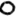
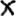

# x-o Classifier

This is a little machine learning demo to classify images showing either the
letter `x` or `o`. The images are stored as greyscale 16x16 pixel PNGs.

## Training Data

The training data is stored in the `train/` folder. The files have names like
`x-[number].png` and `o-[number].png`, denoting images showing an `x` or `o`,
respectively.

Create the training labels in `train.csv` as follows based on that folder:

    $ ./labels.py train train.csv

## Train the Model

When the data is labeled, train the model as follows:

    $ ./train.py

The weights are stored in `weights.csv`.

## Predict

When the weights are computed, run a prediction on the data in the `predict/`
folder (same structure as `train/`).

First, create the prediction labels:

    $ ./labels.py predict predict.csv

Second, run the predictions:

    $ ./predict.py

## Demo

Save a greyscale 16x16 pixel image as `demo.png`. Then run the demo on it for a
prediction:

    $ ./demo.py demo.png
    demo.png:
          P("x")=0.07%
          P("o")=99.93%

There is also demo data available:

    $ ./demo.py demo-o.png
    demo-o.png:
        P("x")=0.07%
        P("o")=99.93%

    $ ./demo.py demo-x.png
    demo-x.png:
        P("x")=99.85%
        P("o")=0.15%
